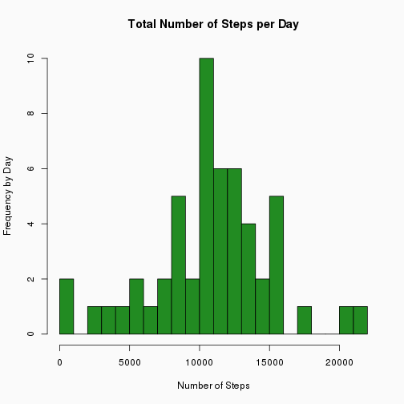
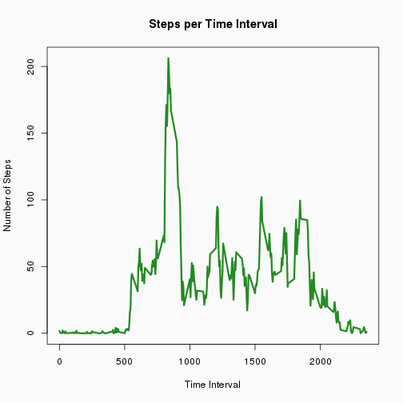
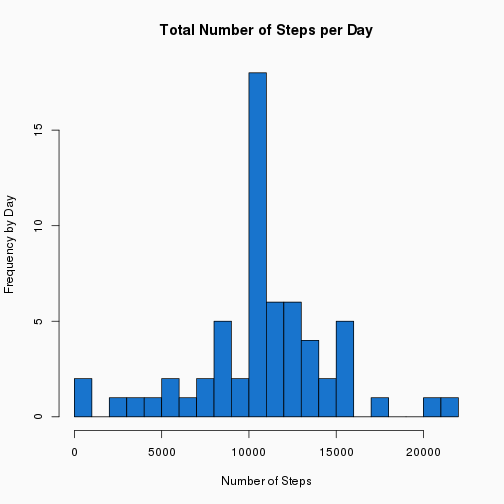
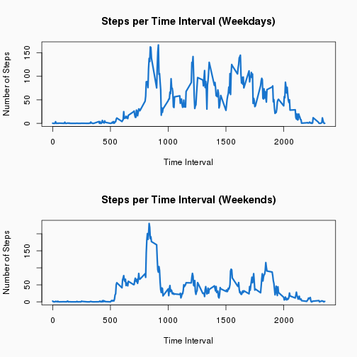

#### Reproducible Research Assignment 1
#### Steven Maestas
#### February 15, 2016

Reproducible Research: Course Project 1
=============================================

The purpose of this assignment is to create a hybird document consisting of markup and R code which allows explanation of the research as well as recreation of any methods, measures and algorithms used to justify any conclusions.  This file documents the analysis of two months of activity from a personal activity monitoring device.  This device had collected a subject's estimated number of steps in 5-minute increments from the period of October through November 2012.  Below is the analysis of this data.  For ease of grading, each section of the file will be numbered according to the numbering criteria outlined in the assignment.

## Loading an preprocessing the data 

1. Load the data


```r
# Load required libraries and the activity.csv which has the relevant data
library(data.table)
```

```
## data.table 1.9.6  For help type ?data.table or https://github.com/Rdatatable/data.table/wiki
```

```
## The fastest way to learn (by data.table authors): https://www.datacamp.com/courses/data-analysis-the-data-table-way
```

```r
stps <- data.table(read.csv(unz("activity.zip","activity.csv")))
```

2. Process/transform the data (if necessary) into a format suitable for your analysis.

For this portion, there will be two main data.tables that we will be using.  The first will be the original data read in via the provided .csv or a variation of this data meant to fill in missing values.  Additionally, there will be  data table that contains the aggregation of steps by day.


```r
# Aggregate the total number of steps per day (excluding missing data)
sumstps <- data.table(aggregate(steps~date,data=stps,FUN=sum))
```

## What is the mean total number of steps taken per day?

1. Calculate the total number of steps per day


```r
# Find the total number of steps per day
sumstps
```

```
##           date steps
##  1: 2012-10-02   126
##  2: 2012-10-03 11352
##  3: 2012-10-04 12116
##  4: 2012-10-05 13294
##  5: 2012-10-06 15420
##  6: 2012-10-07 11015
##  7: 2012-10-09 12811
##  8: 2012-10-10  9900
##  9: 2012-10-11 10304
## 10: 2012-10-12 17382
## 11: 2012-10-13 12426
## 12: 2012-10-14 15098
## 13: 2012-10-15 10139
## 14: 2012-10-16 15084
## 15: 2012-10-17 13452
## 16: 2012-10-18 10056
## 17: 2012-10-19 11829
## 18: 2012-10-20 10395
## 19: 2012-10-21  8821
## 20: 2012-10-22 13460
## 21: 2012-10-23  8918
## 22: 2012-10-24  8355
## 23: 2012-10-25  2492
## 24: 2012-10-26  6778
## 25: 2012-10-27 10119
## 26: 2012-10-28 11458
## 27: 2012-10-29  5018
## 28: 2012-10-30  9819
## 29: 2012-10-31 15414
## 30: 2012-11-02 10600
## 31: 2012-11-03 10571
## 32: 2012-11-05 10439
## 33: 2012-11-06  8334
## 34: 2012-11-07 12883
## 35: 2012-11-08  3219
## 36: 2012-11-11 12608
## 37: 2012-11-12 10765
## 38: 2012-11-13  7336
## 39: 2012-11-15    41
## 40: 2012-11-16  5441
## 41: 2012-11-17 14339
## 42: 2012-11-18 15110
## 43: 2012-11-19  8841
## 44: 2012-11-20  4472
## 45: 2012-11-21 12787
## 46: 2012-11-22 20427
## 47: 2012-11-23 21194
## 48: 2012-11-24 14478
## 49: 2012-11-25 11834
## 50: 2012-11-26 11162
## 51: 2012-11-27 13646
## 52: 2012-11-28 10183
## 53: 2012-11-29  7047
##           date steps
```

2.Make a histogram of the total number of steps taken each day


```r
# Set the background color to light gray for the plot
par(bg="gray98")

# Create a histogram of the total number of steps per day (excluding missing values)
hist(sumstps$steps,breaks=20, col="forestgreen",xlab="Number of Steps", ylab="Frequency by Day", main="Total Number of Steps per Day")
```



3. Calculate and report the mean and the median of the total number of steps taken per day

Mean:

```r
# Calculate the mean of all steps (excluding missing values)
mean(sumstps$steps)
```

```
## [1] 10766.19
```

Median:

```r
# Calculate the median of all steps (excluding missing values)
median(sumstps$steps)
```

```
## [1] 10765
```

## What is the average daily activity pattern?

1. Make a time series plot (i.e. type="l") of the 5-minute interval (x-axis) and the average number of steps taken, averaged across all days(y-axis)

Here we are aggregating the data by interval using the mean function to find the average amount of steps taken per day per interval, then we create a time series plot based on the data.


```r
# Set the background color to gray
par(bg="gray98")

# Aggregate all the steps by interval (missing values are excluded)
intrvl <- aggregate(steps~interval, data=stps, FUN=mean)

# Plot the average by 5-minute intervals
plot(intrvl, type="l", col="forestgreen", lwd=3, xlab="Time Interval", ylab="Number of Steps", main="Steps per Time Interval")
```



2. Which 5-minute interval, on average across all the days in the dataset, contains the maximum number of steps?

In this case, we just need to find the maximum number of steps in the interval data.table.


```r
# Let us find the max average interval
intrvl[intrvl$steps == max(intrvl$steps),]$steps
```

```
## [1] 206.1698
```

We can be a little creative and determine the exact time interval using some math


```r
# Find the hour and minute of the 5-minute interval that has the max average steps
hour <- floor(intrvl[intrvl$steps == max(intrvl$steps),]$interval/60)
minute <- intrvl[intrvl$steps == max(intrvl$steps),]$interval%%60

# If the hour is greater than 12, then subtract 12 to format as 12-hour time.
if(hour<12) {
   paste(paste(hour,minute,sep=":"),"AM", sep=" ")
} else {
   paste(paste(hour-12,minute,sep=":"),"PM", sep=" ")
}
```

```
## [1] "1:55 PM"
```

## Inputing missing values

1.  Calculate and report the total number of missing values in the dataset.


```r
# Calcuate the number of rows that have missing data out of the stps data.table
nrow(stps[is.na(stps$steps),])
```

```
## [1] 2304
```

2. Device a strategy for filling in all of the missing values in the dataset

The strategy I will use for filling in the misisng values will be to replace the NA values with the average number of steps for the specific time period across all non-missing values for that specific time period for all dates.  This can easily be done by matching all of the misisng values interval number with the same number which is stored in the intrvl data.table.  This data table stores the mean number of steps aggregated by interval.

3. Create a new dataset that is equal to the original dataset but with the missing data filled in.


```r
# Create a new data table which is a copy of the stps datatable
allstps <- stps

# This line of code imputes missing values in the steps column of the all steps column
allstps[is.na(allstps$steps),]$steps <- as.integer(round(intrvl[,2][match(allstps[is.na(allstps$steps),]$interval,intrvl[,1])]))

# Check to make sure we have no more missing values
nrow(allstps[is.na(allstps$steps),])
```

```
## [1] 0
```

4. Make a histogram of the total number of steps taken each day and calculate and report the mean and median total number of steps taken per day.  Do these values differ from the estimates from the first part of the assignment?  What is the impact of imputing missing data on the estimates of the total daily number of steps?


```r
# Sum all the data by day (with imputed data included)
sumallstps <- data.table(aggregate(steps~date,data=allstps,FUN=sum))

# Set the background color to gray
par(bg="gray98")

# Create the histogram using the base plotting system
hist(sumallstps$steps,breaks=20, col="dodgerblue3",xlab="Number of Steps", ylab="Frequency by Day", main="Total Number of Steps per Day")
```



Mean:

```r
# Calculate the mean when all NA's have been replaced with estimated data
mean(sumallstps$steps)
```

```
## [1] 10765.64
```

Median:

```r
# Calculate the median when all NA's have been replaced with estimated data
median(sumallstps$steps)
```

```
## [1] 10762
```

The differences between the mean and median when values are imputed to missing values is not very great.  The mean and median stay very close to their orignal values.  The mean only differs by 0.55 and the median only differs by 3.  This makes sense because the missing values seem to be grouped together by day and we are really adding another average day to the existing data.  Additionally, this explains why only the average range of the histogram bar seems to grow from the original to the inputed data.

## Are there differences in activity patterns between weekdays and weekends?

1. Create a new factor variable in the dataset with two levels = "weekday" and "weekend" indicating whether a given date is a weekday or a weekend day.


```r
# Create a new factor variable/vectore named days
days <- factor(weekdays(as.Date(allstps$date)))

# Assign each factor to a level of either weekday or weekend
levels(days) <- list(weekend=c("Sunday","Saturday"),weekday=c("Monday","Tuesday","Wednesday","Thursday","Friday"))

# Add days vector to the allstps data.table
allstps$days <- days
```

2. Make a panel plot containing a time series plot of the 5-minute interval (x-axis) and the average number of steps taken, average across all weekdays or weekend days (y-axis).


```r
# Set the background color to light gray for the plot and make the plot a 1-column by 2-row panel
par(mfrow=c(2,1),bg="gray98")

# Split the allstps data.table into a weekend subset and a weekday subset
weekend <- allstps[allstps$days == "weekend"]
weekdays <- allstps[allstps$days == "weekday"]

# Aggregate all steps for the weekend and weekday data.tables by interval and mean
sumweekend <- aggregate(steps ~ interval, data=weekdays, FUN=mean)
sumweekdays <- aggregate(steps ~ interval, data=weekend, FUN=mean)

# Create the two time series plots of 5-minute intervals for both the weekend days and weekdays.
plot(sumweekdays, type="l", col="dodgerblue3", lwd=3, xlab="Time Interval", ylab="Number of Steps", main="Steps per Time Interval (Weekdays)")
plot(sumweekend, type="l", col="dodgerblue3", lwd=3, xlab="Time Interval", ylab="Number of Steps", main="Steps per Time Interval (Weekends)")
```


